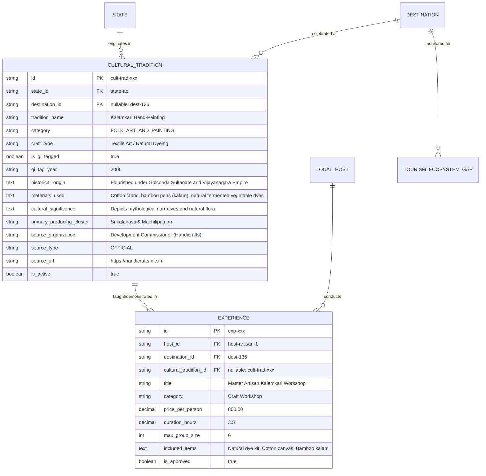

# Phase 21 Local Culture Plan
## Local Culture + Artisan Ecosystem + Cultural Tourism Economy

---

## 1. Executive Summary

YatraSetu is an integrated triple-stakeholder tourism ecosystem connecting **Travelers**, **Local Partners**, and **Government Tourism Authorities**. Phase 21 deepens this ecosystem around India's living cultural heritage, traditional crafts, handlooms, folk arts, and master artisans.

The core design principle of Phase 21 is **Ecosystem Grounding**:
```
Cultural Heritage / Traditional Craft (Structured Fact)
               ↓
    Cultural Discovery & Education (Traveler)
               ↓
  Local Artisan / Cultural Partner (Registered & Verified)
               ↓
   Authentic Workshop / Craft Experience (Bookable Unit)
               ↓
      Traveler Booking & Participation Signals
               ↓
  Government Cultural Tourism Intelligence (Derived Analytics)
               ↓
   Targeted Policy Interventions & Artisan Support
```

Phase 21 is **not a standalone module or disconnected feature**. It natively utilizes and enriches YatraSetu's existing domain models, provenance architecture, RBAC security filters, dynamic redistribution engines, and AI context retrieval grounding.

---

## 2. Existing Architecture Findings

A rigorous audit of the current codebase (`3f04dde`) reveals strong architectural foundations:

### Backend Domain & Data Layer
- **`State` & `City`**: Robust spatial taxonomy covering all 28 Indian States and 8 Union Territories with ISO codes, coordinates, and regional classifications.
- **`Destination` (`destinations` table)**: 164 verified destinations with spatial coordinates, accessibility metrics, and basic text fields (`local_culture`, `festivals_events`, `local_customs`, `shopping_highlights`).
- **`LocalHost` (`local_hosts` table)**: Supports local guides and hosts linked to users with `skills`, `languages`, `interests`, `is_verified`, and `role_title`.
- **`PartnerSubtype` Enum**: Already contains `ARTISAN`, `LOCAL_HOST`, `GUIDE`, `EXPERIENCE_PROVIDER`, `HOMESTAY`, `RESTAURANT`, `HOTEL`.
- **`Experience` (`experiences` table)**: Robust transactional entity supporting pricing, duration, group size, included items, requirements, languages, approval status, and host relationships.
- **`SourceType` Enum**: Established provenance hierarchy (`DATASET`, `OFFICIAL`, `API`, `PARTNER_SUBMITTED`, `USER_GENERATED`, `DEMO`).
- **`TourismDemandSignal` & `TourismDestinationScore`**: Ingestion and scoring of live search, view, and booking signals across destinations.
- **`TourismEcosystemGap` & `TourismGovernmentAction`**: Real-time detection of infrastructure deficits with full government action tracking (`LOGGED` → `IN_PROGRESS` → `RESOLVED`).
- **`AiContextRetrievalService`**: Grounded RAG system retrieving destination metadata, POIs, food, hotels, transports, and intelligence.

### Frontend Components & UX
- **Destination Page (`/destinations/[id]`)**: Structured tabbed/sectional layout with `FamousFoodSection`, `TransportSection`, `RestaurantsSection`, `RentalProvidersSection`, `TravelAgenciesSection`.
- **`ProvenanceBadge`**: Displays normalized provenance badges (`Official`, `Dataset`, `Verified Partner`, `Partner Listing`, `Traveler Submitted`).
- **`EcosystemEmptyState`**: Honest empty states prompting local partner onboarding when listings are zero.
- **Partner Dashboard (`/partner/dashboard`)**: Experience management with modal editing, strict server-side tenant authorization, and category selectors.
- **Government Dashboard (`/government/dashboard`)**: KPI cards, Dynamic Redistribution Corridors, Health Classifications (`HIGH_PRESSURE`, `WATCH`, `HEALTHY`, `UNDERUTILIZED`), Ecosystem Gaps, and Government Action Center.

---

## 3. Reusable Components

| Component / System | Classification | Rationale |
| :--- | :--- | :--- |
| **`experiences` Table & Entity** | **REUSE** | Represents bookable artisan workshops, masterclasses, and cultural walks with duration, pricing, capacity, and inclusions. |
| **`local_hosts` & `User` (Role: PARTNER)** | **REUSE** | Represents artisan hosts and cultural masters. `PartnerSubtype.ARTISAN` already exists. |
| **`State`, `City`, `Destination`** | **REUSE** | Provides canonical geographic hierarchy for cultural traditions across all 28 States and 8 UTs. |
| **`SourceType` & `ProvenanceBadge`** | **REUSE** | Distinguishes official government facts (`OFFICIAL`/`DATASET`) from partner listings (`PARTNER_SUBMITTED`). |
| **`TourismDemandSignal`** | **EXTEND** | Can record demand signals tagged with cultural interest keywords and destination views. |
| **`TourismEcosystemGap`** | **EXTEND** | Add cultural deficit gap types to detect underserved artisan regions. |
| **`TourismGovernmentAction`** | **REUSE** | Government officers can log, assign, and resolve artisan onboarding and craft promotion actions. |
| **`Trip` & AI Trip Planner** | **EXTEND** | Ground itinerary generation with cultural workshops and heritage craft visits. |
| **`AiContextRetrievalService`** | **EXTEND** | Inject cultural traditions and artisan workshops into AI system prompts with `[STRUCTURED_FACT]` tags. |

---

## 4. New Components Required

To ensure clean normalization and separation of immutable cultural heritage facts from transient partner listings, the following additions are required:

1. **`CulturalTradition` Entity (`cultural_traditions` Table)**:
   - Normalized repository of authentic regional crafts, handlooms, folk arts, performing arts, and culinary traditions.
2. **`CulturalCategory` Enum / Taxonomy**:
   - Standardized classification: `HANDLOOM`, `CRAFT_AND_POTTERY`, `FOLK_ART_AND_PAINTING`, `PERFORMING_ARTS`, `METALWORK_AND_JEWELLERY`, `HERITAGE_SKILLS`, `CULINARY_HERITAGE`.
3. **`CulturalOpportunityService` & Score Formula**:
   - Transparent, explainable algorithmic calculation of regional cultural tourism potential based on platform supply and demand.
4. **Cultural Supply Gap Detection in `EcosystemGapDetectionService`**:
   - Automated detection of `CULTURAL_EXPERIENCE_DEFICIT` and `ARTISAN_PARTNER_DEFICIT`.
5. **Destination `LocalCultureSection` Component**:
   - Modern, responsive UI displaying authentic cultural traditions, GI tags, artisan history, and nearby verified workshops with honest empty states.

---

## 5. Cultural Data Model

### Minimum Normalized Schema



### Strict Separation of Facts vs. Bookings
- **`CulturalTradition` = Structured Fact**: Immutable cultural heritage knowledge sourced from Ministry of Textiles / DC Handicrafts / GI Registry. Sourced as `OFFICIAL` or `DATASET`.
- **`Experience` = Bookable Partner Listing**: Commercial, transient workshop offered by a registered host (`PARTNER_SUBMITTED`). Sourced independently with its own verification status.

---

## 6. State & UT Cultural Coverage Strategy

Phase 21 covers all **28 States and 8 Union Territories** with distinct, authentic, and regional cultural craft traditions.

### Authentic State/UT Cultural Craft Inventory

| State / UT | Authentic Cultural Craft Traditions | GI / Official Classification | Primary Producing Cluster |
| :--- | :--- | :--- | :--- |
| **Andhra Pradesh** | Srikalahasti Kalamkari, Kondapalli Toys, Dharmavaram Silk, Machilipatnam Kalamkari | GI Tagged | Srikalahasti, Krishna, Anantapur |
| **Arunachal Pradesh** | Wancho Wood Carving, Monpa Handmade Paper, Apatani Textile Weaving | State Craft Board | Longding, Tawang, Ziro Valley |
| **Assam** | Muga Silk Weaving, Majuli Mask Making, Sarthebari Bell Metal | GI Tagged / Heritage | Sualkuchi, Majuli Island, Barpeta |
| **Bihar** | Madhubani (Mithila) Painting, Sikki Grass Craft, Bhagalpur Tussar Silk | GI Tagged | Madhubani, Darbhanga, Bhagalpur |
| **Chhattisgarh** | Bastar Dhokra Bell Metal, Bastar Iron Craft, Terracotta Pottery | GI Tagged | Jagdalpur, Kondagaon |
| **Goa** | Kunbi Handloom Weaving, Terracotta Pottery, Azulejos Ceramic Tiles | State Heritage | Chandor, Bicholim, Panaji |
| **Gujarat** | Rogan Art, Patan Patola, Kutch Lippan Mud Art, Bandhani Tie-Dye | GI Tagged | Nirona, Patan, Bhuj, Jamnagar |
| **Haryana** | Panipat Handloom Weaving, Jhajjar Pottery, Brassware | DC Handlooms | Panipat, Rewari, Jhajjar |
| **Himachal Pradesh** | Kullu Shawl Weaving, Chamba Rumal Embroidery, Kangra Miniature Painting | GI Tagged | Kullu, Chamba, Kangra |
| **Jharkhand** | Sohrai-Khovar Painting, Dokra Brass Metalcraft, Paitkar Scroll Painting | GI Tagged | Hazaribagh, Dumka, Khunti |
| **Karnataka** | Mysore Silk Weaving, Channapatna Wooden Toys, Bidriware Metal Inlay | GI Tagged | Mysore, Channapatna, Bidar |
| **Kerala** | Aranmula Kannadi Metal Mirror, Kasaragod Sarees, Nilambur Teak Carving | GI Tagged | Aranmula, Balaramapuram, Nilambur |
| **Madhya Pradesh** | Chanderi Weaving, Bagh Print Block Printing, Gond Tribal Painting | GI Tagged | Ashoknagar, Dhar, Dindori |
| **Maharashtra** | Paithani Silk Weaving, Warli Tribal Painting, Kolhapuri Chappals | GI Tagged | Paithan, Dahanu, Kolhapur |
| **Manipur** | Moirang Phee Weaving, Longpi Black Stone Pottery, Kauna Reed Craft | GI Tagged | Bishnupur, Ukhrul, Imphal |
| **Meghalaya** | Ryndia Eri Silk Weaving, Khasi Cane & Bamboo Weaving | State Sericulture | Ri-Bhoi, Sohra, Jaintia |
| **Mizoram** | Puan Handloom Weaving, Bamboo Stool & Basketry | State Handlooms | Aizawl, Thenzawl |
| **Nagaland** | Naga Chakesang Shawl Weaving, Wood & Bone Carving, Black Terracotta | GI Tagged | Kohima, Mokokchung |
| **Odisha** | Raghurajpur Pattachitra, Pipili Applique Work, Sambalpuri Ikat Weaving | GI Tagged | Puri, Sambalpur, Pipili |
| **Punjab** | Phulkari Needlework Embroidery, Wood Inlay Work, Jutti Making | GI Tagged | Patiala, Amritsar, Hoshiarpur |
| **Rajasthan** | Bagru Hand Block Print, Blue Pottery, Pichwai Painting, Thewa Gold Work | GI Tagged | Jaipur, Nathdwara, Pratapgarh |
| **Sikkim** | Lepcha Weaving, Thangka Painting, Wooden Choktse Carving | State Directorate | Gangtok, Ravangla |
| **Tamil Nadu** | Kanchipuram Silk, Thanjavur Gold Leaf Painting, Swamimalai Bronze Icons | GI Tagged | Kanchipuram, Thanjavur, Swamimalai |
| **Telangana** | Pochampally Ikat, Cheriyal Scroll Painting, Pembarthi Metal Craft | GI Tagged | Yadadri Bhuvanagiri, Jangaon |
| **Tripura** | Risa Handloom Weaving, Bamboo & Cane Basketry | GI Tagged | Agartala, Radhakishorepur |
| **Uttar Pradesh** | Varanasi Silk Brocade, Lucknow Chikankari, Moradabad Brass, Firozabad Glass | GI Tagged | Varanasi, Lucknow, Moradabad |
| **Uttarakhand** | Aipan Folk Painting, Ringal Bamboo Craft, Almora Tweed Weaving | GI Tagged | Kumaon, Almora, Chamoli |
| **West Bengal** | Kalighat Painting, Bishnupur Terracotta & Baluchari Silk, Dokra Metal | GI Tagged | Bankura, Shantiniketan, Kolkata |
| **Andaman & Nicobar** | Nicobarese Cane Craft, Shell Jewellery, Wood Carving | UT Directorate | Port Blair, Car Nicobar |
| **Chandigarh** | Rock Garden Stone Assemblage Art, Modern Architectural Craft | UT Heritage | Chandigarh Sector 1 |
| **Dadra & Nagar Haveli and Daman & Diu** | Varli Art, Mat Weaving, Tortoiseshell Craft | UT Tourism | Silvassa, Daman |
| **Delhi** | Zardozi Embroidery, Meenakari Enamelling, Mughal Paper Mache | DC Handicrafts | Old Delhi, Mehrauli |
| **Jammu & Kashmir** | Pashmina Shawl Weaving, Kashmiri Walnut Wood Carving, Paper Mache, Kani Shawls | GI Tagged | Srinagar, Budgam, Anantnag |
| **Ladakh** | Ladakh Pashmina (Lena), Thangka Scroll Art, Ladakhi Wood Carving | GI Tagged | Leh, Zanskar |
| **Lakshadweep** | Coconut Shell Craft, Coir Mat Making, Coral Stone Architecture | UT Industries | Kavaratti, Minicoy |
| **Puducherry** | Puducherry Terracotta, Handmade Paper, Auroville Incense & Ceramic Craft | GI Tagged | Villianur, Auroville |

---

## 7. Data Source & Provenance Strategy

### Authoritative Sources

1. **Development Commissioner (Handicrafts) / Ministry of Textiles, Govt. of India**
   - *Data*: National handicraft clusters, artisan traditions, raw materials, toolkits.
   - *Provenance*: `source_organization = "Development Commissioner (Handicrafts)"`, `source_type = "OFFICIAL"`.
2. **Geographical Indications Registry (Intellectual Property India, Ministry of Commerce & Industry)**
   - *Data*: Registered GI Craft numbers, GI application years, certified geographic boundary clusters.
   - *Provenance*: `source_organization = "GI Registry, Govt. of India"`, `source_type = "OFFICIAL"`.
3. **UNESCO Intangible Cultural Heritage Database**
   - *Data*: Inscribed Indian traditions (e.g., Sankirtana, Kalbelia, Kumbh Mela, Dokra).
   - *Provenance*: `source_organization = "UNESCO ICH"`, `source_type = "OFFICIAL"`.
4. **State Tourism & Handicraft Development Corporations (e.g., APCO, Kairali, Boyanika, CCIC)**
   - *Data*: State-level artisan guilds, regional workshops, mastercraftsmen profiles.
   - *Provenance*: `source_organization = "State Handicraft Development Corp"`, `source_type = "DATASET"`.

---

## 8. Traveler Experience Design

### Journey Map
```
Explore Page / Destination Page
  ↓
"Local Culture & Traditional Crafts" Section
  ↓
Browse Cultural Traditions (Filter by Craft, Handloom, Folk Art)
  ↓
Inspect Cultural Tradition Details (GI Tag, History, Materials, Producing Clusters)
  ↓
View "Nearby Verified Artisan Workshops"
  ↓
Select Experience → View Duration, Inclusions, Languages, Price
  ↓
"Book Workshop" → Simulated Payment Flow
  ↓
Confirmed Booking in "My Trips"
```

### UI States & Empty Handling
- **Cultural Fact Available + Verified Experiences Present**: Display rich cultural heritage card with active "Book Artisan Masterclass" cards below.
- **Cultural Fact Available + Zero Verified Experiences**: Display rich cultural heritage card followed by an honest, constructive callout:
  > *"Authentic cultural tradition documented. There are currently no verified partner workshops registered for this craft in this destination."*
  > **[Register as a Local Artisan Partner]**
- **Zero Cultural Facts for Destination**: Clean, non-intrusive empty state without broken UI.
- **Icon Integrity**: Use cultural icons (`Palette`, `Scissors`, `Flame`, `Sparkles` **strictly disallowed** here to preserve the AI distinction rule).

---

## 9. Local Partner Dashboard Extension

### Artisan Partner Capabilities
- **Registration**: Partners select `PartnerSubtype.ARTISAN` or `LOCAL_HOST` during onboarding.
- **Cultural Listing Association**: When creating an experience under category `Craft Workshop` or `Heritage Tour`, partners select the linked `CulturalTradition` from the state/destination registry.
- **Artisan Metadata**: Specify:
  - What the traveler makes (e.g. *"Take-home 12x12 hand-painted Kalamkari cloth piece"*)
  - Materials provided (e.g. *"Natural vegetable dyes, cotton fabric, bamboo kalam pen"*)
  - Maximum participants (e.g. `4` for high personal guidance)
- **Security & RBAC**:
  - Strict partner tenant isolation: Partner A cannot modify or delete Partner B's workshop.
  - Sourced as `PARTNER_SUBMITTED`. Displayed with `ProvenanceBadge` (`Partner Listing` if pending verification, `Verified Partner` only after admin approval).

---

## 10. Government Cultural Tourism Intelligence

A dedicated tab on `/government/dashboard`: **"Cultural Tourism & Local Economy"**.

### Classification of Metrics
| Metric Name | Value Example | Grounding Classification | Meaning |
| :--- | :--- | :--- | :--- |
| **Cultural Traditions Documented** | `112` | `STRUCTURED_FACT` | Authentic traditions registered from official sources. |
| **Registered Cultural Partners** | `14` | `DERIVED_PLATFORM_METRIC` | Total platform partners with subtype `ARTISAN`. |
| **Active Cultural Workshops** | `22` | `DERIVED_PLATFORM_METRIC` | Verified active experiences linked to cultural traditions. |
| **Cultural Demand Signals** | `1,240` | `DERIVED_PLATFORM_METRIC` | Traveler queries and page views focused on local crafts. |
| **Artisan Workshop Booking Volume** | `86` | `DERIVED_PLATFORM_METRIC` | Simulated and active bookings for cultural experiences. |
| **Cultural Opportunity Index** | `78.4 / 100` | `DERIVED_PLATFORM_METRIC` | Algorithmic potential score (see Section 11). |
| **Cultural Supply Gaps Detected** | `6` | `DERIVED_PLATFORM_METRIC` | Destinations with high cultural interest but zero workshops. |

> [!IMPORTANT]
> Platform metrics must **never** be labeled as "State Cultural GDP" or "Official Tourism Receipts". They are strictly platform-derived engagement indicators.

---

## 11. Cultural Tourism Opportunity Score Formula

### Exact Mathematical Model
$$\text{CulturalOpportunityScore} = \min(100, \max(0, S_{\text{tradition}} + S_{\text{demand}} + S_{\text{supply}} - S_{\text{gap\_penalty}}))$$

Where:
1. **$S_{\text{tradition}}$ (Base Cultural Heritage Richness — Max 30 pts)**:
   - Base points for documented traditions in destination/city: $\min(30, N_{\text{traditions}} \times 10)$
   - Bonus +5 pts if any tradition has an official `GI_TAG`.
2. **$S_{\text{demand}}$ (Traveler Cultural Demand — Max 35 pts)**:
   - Logarithmic scaling of search and view signals: $\min\left(35, 10 \times \ln(1 + N_{\text{cultural\_signals}})\right)$
3. **$S_{\text{supply}}$ (Verified Experience Availability — Max 25 pts)**:
   - Verified active workshops: $\min(25, N_{\text{verified\_workshops}} \times 8.33)$
4. **$S_{\text{gap\_penalty}}$ (Deficit Penalty — Max 20 pts)**:
   - If Cultural Demand $\ge 10$ and Verified Workshops $= 0 \implies \text{Penalty} = 15$ pts.
   - If Cultural Demand $\ge 25$ and Verified Workshops $= 0 \implies \text{Penalty} = 20$ pts.

### Score Explainability Example
- **Destination**: Srikalahasti (`dest-srikalahasti`)
- **Score**: `82 / 100` (High Opportunity)
- **Breakdown**:
  - `+30`: Official GI-tagged Srikalahasti Kalamkari tradition documented.
  - `+28`: High search interest from cultural travelers.
  - `+24`: Verified master artisan workshops actively accepting bookings.
  - `-0`: Zero supply bottleneck.

---

## 12. Cultural Supply Gap Detection Algorithms

Extended in `EcosystemGapDetectionService.java`:

### 1. `CULTURAL_EXPERIENCE_DEFICIT`
- **Condition**: Documented cultural traditions $\ge 1$ AND (Destination Demand Signals $\ge 5$ OR Popularity Score $\ge 60.0$) AND Verified Cultural Experiences $= 0$.
- **Severity**: `HIGH`
- **Government Action**: *"Promote local artisan onboarding and workshop curation for documented cultural traditions in this cluster."*

### 2. `ARTISAN_PARTNER_DEFICIT`
- **Condition**: Documented cultural traditions $\ge 1$ AND Verified Artisan Hosts $= 0$.
- **Severity**: `MEDIUM`
- **Government Action**: *"Engage District Industries Centre (DIC) and State Handicrafts Corporation to register master craftspersons."*

---

## 13. Dynamic Cultural Redistribution Integration

Extended in `DynamicRedistributionService.java`:

### Concept
Pair high-pressure destinations (e.g. `Varanasi` or `Jaipur`) with nearby cultural heritage clusters (e.g. `Chunar` for Black Clay Pottery, or `Sanganer`/`Bagru` for Hand Block Printing).

### Pairing Logic
- **Source**: High-pressure destination (Activity Pressure $\ge 55.0$).
- **Target**: Within $150\text{ km}$, Activity Pressure $\le 45.0$, Documented Cultural Traditions $\ge 1$, Verified Cultural Workshops $\ge 1$.
- **Redistribution Narrative**:
  > *"Cultural Heritage Diversification Corridor: Relieve urban heritage congestion by promoting direct master artisan block printing workshops in Bagru (30 km away)."*

---

## 14. Government AI Retrieval & Grounding

`AiContextRetrievalService` will retrieve `CulturalTradition` and `CulturalOpportunityScore` records:

### System Prompt Guardrails
```text
[STRUCTURED_FACT]
Tradition: Srikalahasti Kalamkari (GI Tagged)
Origin: Srikalahasti, Andhra Pradesh
Materials: Natural vegetable dyes, fermented jaggery, bamboo kalam

[DERIVED_PLATFORM_METRIC]
Verified Workshops on YatraSetu: 2
YatraSetu Cultural Opportunity Score: 82/100

[UNAVAILABLE_INFORMATION]
Official annual state turnover for Kalamkari craft is unavailable in platform records.
```

The AI must never hallucinate economic statistics or claim unverified external metrics.

---

## 15. API Design Plan

| Method | Endpoint | Access / RBAC | Description |
| :--- | :--- | :--- | :--- |
| `GET` | `/api/v1/culture/traditions` | Public | List all cultural traditions with optional state, destination, or category filter. |
| `GET` | `/api/v1/culture/traditions/{id}` | Public | Get single cultural tradition details including GI info and producing clusters. |
| `GET` | `/api/v1/destinations/{id}/culture` | Public | Get cultural traditions and verified cultural experiences for a destination. |
| `GET` | `/api/v1/states/{id}/culture` | Public | Get state-level cultural inventory across all categories. |
| `GET` | `/api/v1/experiences` (category=`Craft Workshop`) | Public | List bookable cultural experiences. |
| `GET` | `/api/v1/intelligence/culture/overview` | `ROLE_GOVERNMENT` | Get state/national cultural tourism opportunity overview. |
| `GET` | `/api/v1/intelligence/culture/gaps` | `ROLE_GOVERNMENT` | List cultural supply deficits with severity and recommended actions. |
| `POST` | `/api/v1/partner/experiences` | `ROLE_PARTNER` | Create a new artisan workshop or cultural tour. |
| `PUT` | `/api/v1/partner/experiences/{id}` | `ROLE_PARTNER` (Owner) | Update an owned cultural experience. |

---

## 16. Database & Flyway Migration Plan

### Flyway Migration: `V16__local_culture_and_artisan_ecosystem.sql`

```sql
-- 1. Create cultural traditions table
CREATE TABLE cultural_traditions (
    id VARCHAR(64) PRIMARY KEY,
    state_id VARCHAR(50) NOT NULL REFERENCES states(id) ON DELETE CASCADE,
    destination_id VARCHAR(50) REFERENCES destinations(id) ON DELETE SET NULL,
    city_id VARCHAR(50) REFERENCES cities(id) ON DELETE SET NULL,
    tradition_name VARCHAR(255) NOT NULL,
    category VARCHAR(100) NOT NULL,
    craft_type VARCHAR(150),
    is_gi_tagged BOOLEAN DEFAULT FALSE,
    gi_tag_year VARCHAR(10),
    historical_origin TEXT,
    materials_used TEXT,
    cultural_significance TEXT,
    primary_producing_cluster VARCHAR(255),
    source_organization VARCHAR(255) DEFAULT 'Ministry of Textiles / DC Handicrafts',
    source_type VARCHAR(50) NOT NULL DEFAULT 'OFFICIAL',
    source_url TEXT,
    image_url TEXT,
    is_active BOOLEAN NOT NULL DEFAULT TRUE,
    created_at TIMESTAMP WITH TIME ZONE DEFAULT CURRENT_TIMESTAMP,
    updated_at TIMESTAMP WITH TIME ZONE DEFAULT CURRENT_TIMESTAMP
);

-- 2. Indexes for efficient lookup
CREATE INDEX idx_cultural_traditions_state ON cultural_traditions(state_id);
CREATE INDEX idx_cultural_traditions_dest ON cultural_traditions(destination_id);
CREATE INDEX idx_cultural_traditions_category ON cultural_traditions(category);

-- 3. Link experiences to cultural traditions (optional nullable FK)
ALTER TABLE experiences ADD COLUMN cultural_tradition_id VARCHAR(64) REFERENCES cultural_traditions(id) ON DELETE SET NULL;
CREATE INDEX idx_experiences_cultural_tradition ON experiences(cultural_tradition_id);
```

---

## 17. Security, RBAC & Data Isolation

1. **Traveler Read Access**:
   - Cultural facts (`cultural_traditions`) and approved active experiences are publicly readable.
2. **Partner Tenant Isolation**:
   - Partner A cannot update or delete Partner B's experiences. Enforced via `experience.host.user.id == authenticatedUser.id` in `ExperienceService`.
3. **Government Role Enforcement**:
   - All `/api/v1/intelligence/culture/**` endpoints are protected with `@PreAuthorize("hasRole('GOVERNMENT') or hasRole('ADMIN')")`.
4. **Zero Exposure of Private Data**:
   - Artisan phone numbers and bank details are never exposed to travelers; booking inquiries go through platform communication and verified vouchers.

---

## 18. Testing & Validation Plan

### Backend Automated Tests
1. **`CulturalTraditionServiceTest`**: Test state/destination filtering, category queries, and GI tag retrievals.
2. **`CulturalOpportunityServiceTest`**: Unit test calculation weights, score clamping ($0 \le \text{Score} \le 100$), and explainability strings.
3. **`CulturalGapDetectionTest`**: Verify detection of `CULTURAL_EXPERIENCE_DEFICIT` when demand exists without verified workshops.
4. **`PartnerSecurityTest`**: Verify cross-tenant write operations fail with HTTP 403 Forbidden.
5. **`AiGroundingTest`**: Verify AI responses cite `[STRUCTURED_FACT]` and never invent ₹ crore turnover numbers.

### Frontend Quality Assurance
1. **Explore & Destination Pages**: Test responsive rendering of cultural tradition cards and category filters.
2. **Empty State Validation**: Confirm honest copy displays when workshops are zero.
3. **Partner Dashboard**: Verify experience modal permits selecting craft categories and publishing without errors.
4. **No Sparkle Misuse**: Confirm sparkles icon is strictly limited to AI components.

---

## 19. Phase-by-Phase Implementation Roadmap

| Phase | Focus Area | Deliverables | Verification |
| :--- | :--- | :--- | :--- |
| **21.1** | Schema & Taxonomy | `V16__local_culture_and_artisan_ecosystem.sql`, Domain Entities, Repositories, DTOs | `./mvnw test` |
| **21.2** | Authentic Data Ingestion | Structured seed data for 28 States + 8 UTs (Ministry of Textiles / GI sources) | DB Validation script |
| **21.3** | Traveler Discovery | Destination page Local Culture section, Category filters, Provenance badges | `npm run build` |
| **21.4** | Partner Cultural Hub | Partner dashboard artisan listing flow, category selector, tenant security | RBAC unit tests |
| **21.5** | Booking Integration | Booking simulation for craft workshops, My Trips itinerary sync | End-to-end booking flow |
| **21.6** | Government Intelligence | Cultural Tourism KPI cards, Cultural Opportunity score calculation | Intelligence unit tests |
| **21.7** | Cultural Supply Gaps | Deficit detection engine, Government action resolution | Gap simulation tests |
| **21.8** | Dynamic Corridors | Cultural redistribution pairing logic in `DynamicRedistributionService` | Corridor algorithm test |
| **21.9** | Government AI | Grounded cultural RAG prompts with `[STRUCTURED_FACT]` classification | AI response test |
| **21.10** | Comprehensive Audit | Full end-to-end regression validation across all 3 personas | 0 lint errors, all tests PASS |

---

## 20. Data Honesty Rules & Explicit Non-Goals

### Non-Negotiable Data Honesty Rules
1. **Never fabricate economic statistics**: Do not show fake GDP contribution, employment figures, or fake ₹ crore revenue numbers.
2. **Never fabricate fake partner businesses**: If a destination has 0 verified workshops, honestly display 0 workshops.
3. **Clear Provenance**: Clearly distinguish official heritage facts (`OFFICIAL`) from partner listings (`PARTNER_SUBMITTED`).
4. **No Generic Cultural Bucketing**: Every state and Union Territory must have its own distinct, authentic cultural craft identity.

### Explicit Non-Goals
- Do not build an e-commerce craft shopping marketplace (YatraSetu is an experiential tourism platform, not Amazon/Etsy).
- Do not build a standalone mobile app or separate web application.
- Do not alter V1–V15 migrations or touch `flyway_schema_history`.
- Do not replace human artisan verification with automated unverified scraping.
