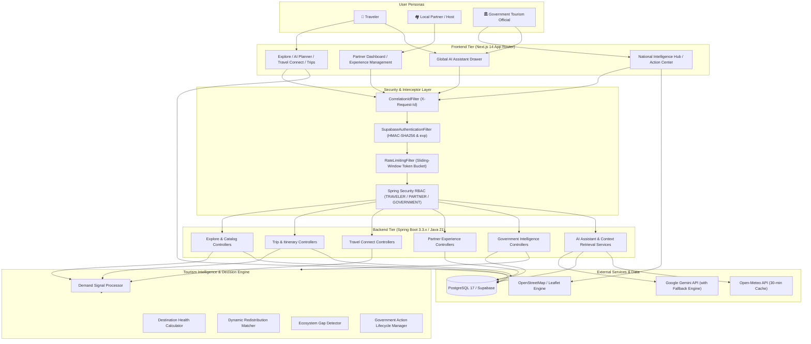

# 🏛️ YatraSetu System Architecture
## End-to-End Technical & Data Architecture

---

## 1. High-Level Ecosystem Topology



---

## 2. Intelligence Data Flow Pipeline

```
┌───────────────────────────┐
│     TRAVELER ACTIVITY     │
│  - Destination Searches   │
│  - AI Itinerary Generated │
│  - Travel Buddy Matches   │
│  - Experience Inquiries   │
└─────────────┬─────────────┘
              │ 1. Asynchronous Signal Recording
              ▼
┌───────────────────────────┐
│  TOURISM DEMAND SIGNALS   │
│  - Signal Type / Weight   │
│  - Destination Node ID    │
│  - Timestamp & Context    │
└─────────────┬─────────────┘
              │ 2. Real-Time Aggregation & Health Processing
              ▼
┌───────────────────────────────────────────────────────────┐
│               TOURISM INTELLIGENCE ENGINE                 │
│  ┌─────────────────────────────────────────────────────┐  │
│  │ Destination Health Score Index (5 Sub-Indices)      │  │
│  │ Dynamic Redistribution Matcher (Geographic Cluster) │  │
│  │ Ecosystem Gap Detector (Homestay / Guide Shortages) │  │
│  │ Prioritized Government Alert Evaluator              │  │
│  └─────────────────────────────────────────────────────┘  │
└─────────────┬─────────────────────────────────────────────┘
              │ 3. Actionable Government Decision Support
              ▼
┌───────────────────────────┐         4. Official Policy Directive
│   GOVERNMENT DASHBOARD    │──────────────────────────────────────┐
│  - Pressure Maps & KPIs   │                                      ▼
│  - Hidden Gem Suggestions │                       ┌─────────────────────────────┐
│  - Redistribution Pairs   │                       │  GOVERNMENT ACTION CENTER   │
│  - Explainable AI Rationale│                       │  - Status: LOGGED           │
└───────────────────────────┘                       │  - Status: IN_PROGRESS      │
                                                    │  - Status: RESOLVED         │
                                                    └─────────────────────────────┘
```

---

## 3. Platform Derivation vs. Official Statistics
A core architectural principle of YatraSetu is **unambiguous provenance**:

| Platform Metric | Data Source | Architectural Derivation | NOT Claimed As |
| :--- | :--- | :--- | :--- |
| **Activity Pressure** | `tourism_demand_signals` | Weighted aggregation of search, planning, and booking interest inside YatraSetu. | Physical IoT gate footfall or real-time camera censuses. |
| **Destination Health** | Internal Formula | Weighted combination of demand, pressure inverse, host density, transit, and sustainability proxy. | Official State Government environmental compliance scores. |
| **Demand Forecast** | Exponential Model | Transparent moving-average extrapolation with seasonal peak-window weighting. | Black-box predictive AI guarantee. |
| **Redistribution Pair** | Geospatial Engine | Proximity query ($\le 250\text{ km}$) matching high-pressure hubs with underutilized gems. | Mandatory tourist routing directive. |
| **Ecosystem Gaps** | Supply-to-Demand Ratio| Threshold analysis comparing registered guides/hosts against attraction volume. | Official Ministry of Labour employment censuses. |

---

## 4. Key Security & Resilience Boundaries

1. **Correlation Tracing**: `CorrelationIdFilter` assigns or propagates an `X-Request-Id` UUID, linking log lines across Spring Boot threads and returning the header to clients for debugging.
2. **Cryptographic Authentication**: `SupabaseAuthenticationFilter` verifies HMAC-SHA256 signatures and expiration claims on Bearer tokens, rejecting tampered or mock tokens in production.
3. **Sliding-Window Rate Limiter**: `RateLimitingFilter` enforces bucket thresholds per IP or authenticated User ID, mitigating DDoS and scraping risks on expensive AI and mutation endpoints.
4. **Timeouts & Caching**: RestTemplate instances enforce 5s connect / 15s read timeouts on Gemini and 3s connect / 5s read timeouts on Open-Meteo, with a 30-minute in-memory cache for weather.
5. **Sanitized Error Responses**: `GlobalExceptionHandler` intercepts unchecked runtime exceptions and renders leak-proof JSON payloads with HTTP 400/401/403/404/429/500 status codes.
